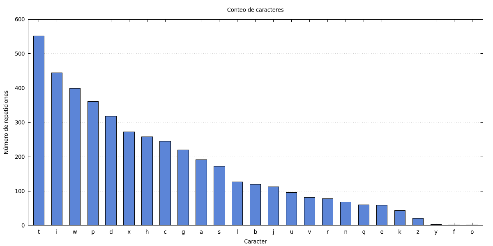
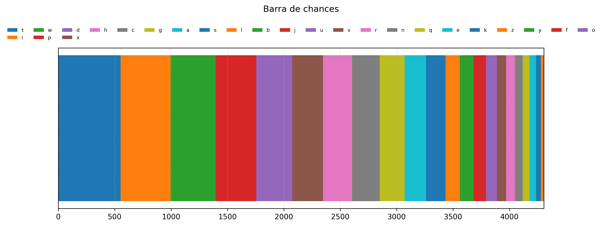

# Actividad_01 - Maching Learning
- Christian Marroquín, Julian Medina
# Ejercicio
- Realizar un codigo que cuente la cantidad de apariciones de cada caracter de un texto. Ademas de generar graficos de las estadisicas (histograma y barra de chances).
## Resultados
Los siguientes resultados se realizaron usando el libro [odyssey](odyssey.txt) el cual se puede encontrar en el siguiente [link](https://www.gutenberg.org/ebooks/1727).
- texto generado aleatoriamente
``` txt
veeboaenamholaedeatfausfasirthtoeuoswmeaeonitossvfuochndhelaeghcderrnworiedgsswhgswadiacfnsdradlatborwheahaiyeseooboadnhueheelanehceugeonegehrenefegiiehutmaehoihsnecismgypnotdtbetmlerarddvnseuisgiesuiilwaewshslcdhreatneaeceodeeesagbiehuareaeeemnemhshiwplklfnhhfuavgflhaoedlafggagwawnybechlpnalooiwhotnnobleeoueeeeaaewangrdecoasmabaetveeadusoatidoowodefedireeededaehmeaogldaeodtbredtjeecohesdhuaddnfsbldelhbleecefxwbtwwtshtrdttebauinaoffoiiinpnhnoddeettrmyeetnhladimgrdhdiepyeemnesiceelcfsatahsdsechehdneaknuxddo
```
- histograma

Se realizo el histograma usando el siguiente [script](histograma.gp) de *gnuplot*.

- barra de chances

Se realizo el grafico de barra de chances con el siguiente [script](barras_apiladas.py) de *python*

- [codigo](text_gen.c), el codigo se solapo con el ya hecho en la actividad en clase, se puede ver el codigo original en el commit anterior al actual.

## glosario
- Histograma de frecuencias: Representación gráfica mediante barras que muestra cuántas veces se repite cada valor o carácter en un conjunto de datos (muy utilizado en criptoanálisis para analizar la aparición de letras en un texto).
- Cifrado por sustitución: Método de encriptación en el que las unidades de texto plano (como letras o grupos de letras) son reemplazadas sistemáticamente por otras letras, símbolos o números según una regla o clave fija.
- Retorno de carro y espacio: Caracteres especiales de control de texto; el retorno de carro (\r o CR) mueve el cursor o punto de inserción al inicio de la línea actual, mientras que el espacio ( ) representa un espacio en blanco entre palabras o símbolos.


# Actividad en clase
Se realizó un intercambio de mensajes encriptados, nuestro mensaje original es [este](mensaje.txt) y su respectivo encriptado con nuestra clave es el [siguiente](mensaje_encriptado.txt).
- clave de encriptacion:
``` txt
abcdefghijklmnopqrstuvwxyz
qwertyuiopasdfghjklzxcvbnm
```

- histograma del mensaje de nuestros compañeros

Se realizo el histograma usando el siguiente [script](histogramacuar.gp) de *gnuplot*.

- barra de chances de nuestros compañeros

Se realizo el grafico de barra de chances con el siguiente [script](barras_apiladascuar.py) de *python*


El texto entregado por ellos es [este](mensaje_cuartas.txt) y el intento de desencriptarlo es [este](mensaje_desencriptado.txt)

- [codigo](text_gen.c).
