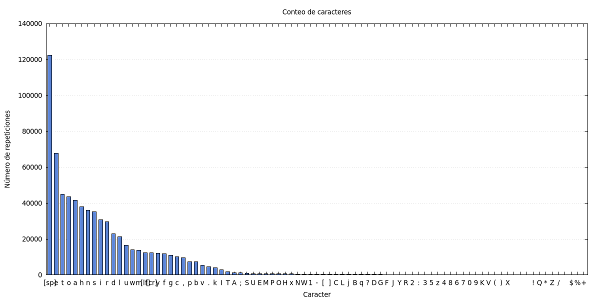
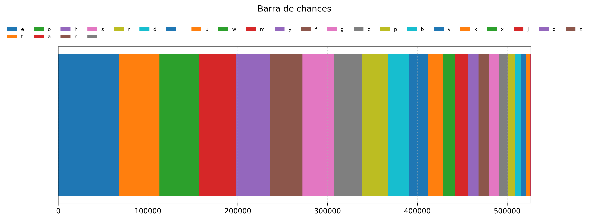

# Actividad_01 - Maching Learning
- Christian Marroquín, Julian Medina
# Ejercicio
- Realizar un codigo que cuente la cantidad de apariciones de cada caracter de un texto. Ademas de generar graficos de las estadisicas (histograma y barra de chances).
## Resultados
Los siguientes resultados se realizaron usando el libro [odyssey](odyssey.txt) el cual se puede encontrar en el siguiente [link](https://www.gutenberg.org/ebooks/1727).
- texto generado aleatoriamente
``` md
outrg ue eafe
t u
nvrniwpibhl
lgtneioe rueeamhiio.nf aes
tdrtxUrstiheofhdtswiioawio
sb
s,ei h
 d m fho
try
cotitef er e
n a, eoe y tnMufeuw yi e .tyca 
nle  agcaie sbkeKoheensn tledui
h  nei nbkyatinbadoo oiZids ah 
net   testutlrF a 
n
iuptttee eaiaaohddd,ea
,n oy,dyreusdr.ywrAo oeo u adheodgecoygneehrdtvhn  ttrrvo eJis  hrier 
 mo  p nle ncseeogsv,t ahttts  
vye ogwd 
 esm h  ndvusf
tis
n
 se.i d  earett  voo moomiami nnu  naerfw.ecaaeheaeg   tnlheo ,neadosaewhsasasho tee ibs se .ion
aisi sa a e rdenosse
```
- histograma

Se realizo el histograma usando el siguiente [script](histograma.gp) de *gnuplot*.

- barra de chances

Se realizo el grafico de barra de chances con el siguiente [script](barras_apiladas.py) de *python*

- [codigo](text_gen).
## glosario
- Histograma de frecuencias: Representación gráfica mediante barras que muestra cuántas veces se repite cada valor o carácter en un conjunto de datos (muy utilizado en criptoanálisis para analizar la aparición de letras en un texto).
- Cifrado por sustitución: Método de encriptación en el que las unidades de texto plano (como letras o grupos de letras) son reemplazadas sistemáticamente por otras letras, símbolos o números según una regla o clave fija.
- Retorno de carro y espacio: Caracteres especiales de control de texto; el retorno de carro (\r o CR) mueve el cursor o punto de inserción al inicio de la línea actual, mientras que el espacio ( ) representa un espacio en blanco entre palabras o símbolos.
